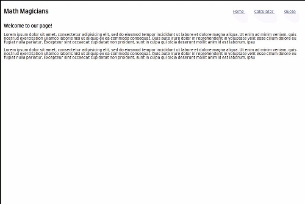

# Calculator app with React
---
## About

This is a calculator app built using React.js which performs simple math operations like; Addition, Subtraction, Multiplication, Division, Percentage, and negation.

### How to use the calculator app.

To perform the operations:
- User should select the first value from the number button (0 - 9)
- User should select the operation buttons (-, +, x, ÷, %)
- User should select the next value for calculation
- Finally, the user can select the '=' button to perform the calculations.

## Getting the app in the local machine.

### Installation instructions

- Clone the repo and navigate to the directory
- Install the npm package with `npm install`
- Start the server with `npm start`
- Open your browser at http://localhost:3000/ and start to perform your calculation.

## Available Scripts

In the project directory, you can run:

### `npm start`

Runs the app in the development mode.\
Open [http://localhost:3000](http://localhost:3000) to view it in the browser.

The page will reload if you make edits.\
You will also see any lint errors in the console.

### `npm test`

Launches the test runner in the interactive watch mode.\
See the section about [running tests](https://facebook.github.io/create-react-app/docs/running-tests) for more information.

### `npm run build`

Builds the app for production to the `build` folder.\
It correctly bundles React in production mode and optimizes the build for the best performance.

The build is minified and the filenames include the hashes.\
Your app is ready to be deployed!

See the section about [deployment](https://facebook.github.io/create-react-app/docs/deployment) for more information.

### `npm run eject`

**Note: this is a one-way operation. Once you `eject`, you can’t go back!**

If you aren’t satisfied with the build tool and configuration choices, you can `eject` at any time. This command will remove the single build dependency from your project.

Instead, it will copy all the configuration files and the transitive dependencies (webpack, Babel, ESLint, etc) right into your project so you have full control over them. All of the commands except `eject` will still work, but they will point to the copied scripts so you can tweak them. At this point, you’re on your own.

You don’t have to ever use `eject`. The curated feature set is suitable for small and middle deployments, and you shouldn’t feel obligated to use this feature. However, we understand that this tool wouldn’t be useful if you couldn’t customize it when you are ready for it.

## Features

The features of this calculator app are:

- It performs basic mathematical operations like; Addition, Subtraction, Multiplication, Division, Percentage, and negation.

## Live Demo

This project is hosted on netlify.

[Live demo link](https://math-magicians-db.netlify.app/)

## Built With

- React.js
- Big.js
- prop-types

## Authors

👤 **Dipesh Bajgain**

- GitHub: [@dipbazz](https://github.com/dipbazz)
- Twitter: [@dipbazz](https://twitter.com/dipbazz)
- LinkedIn: [Dipesh Bajgain](https://www.linkedin.com/in/dipbazz/)

## 🤝 Contributing

Contributions, issues, and feature requests are welcome!

## Show your support

Give a ⭐️ if you like this project!

<!-- ## Acknowledgments -->

## 📝 License

This project is [CC0](./LICENSE) licensed.

